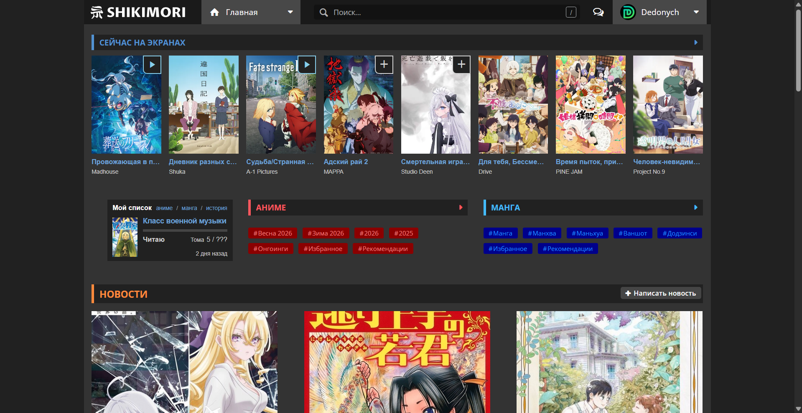
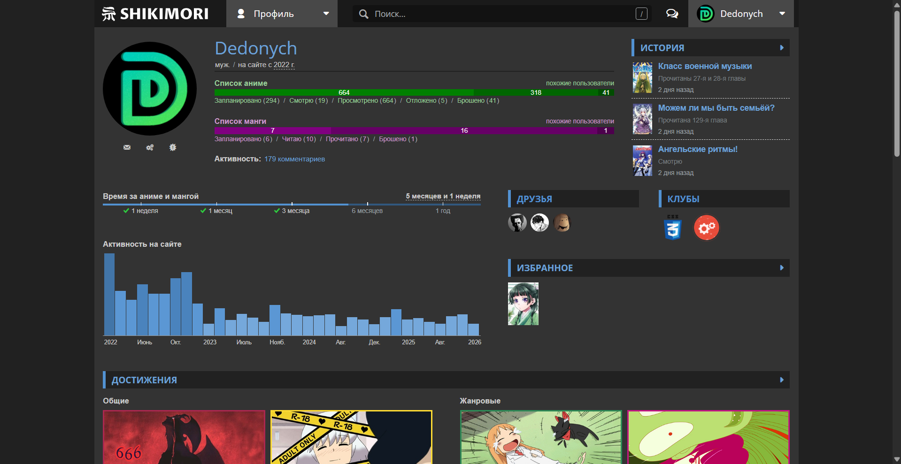
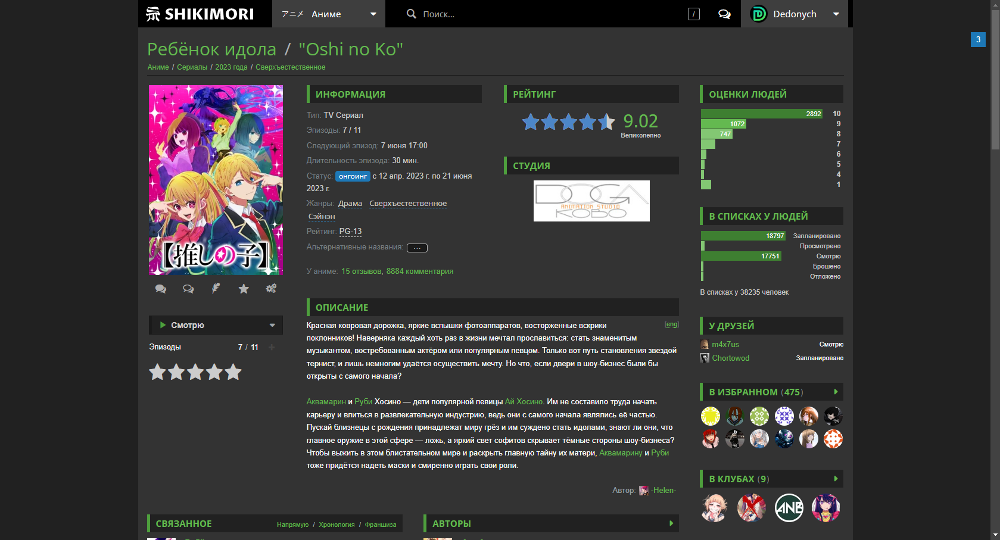
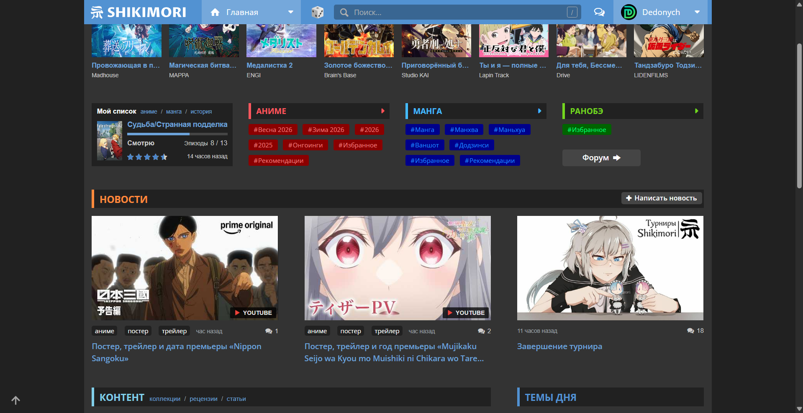

В разработке!
# Темная тема для сайта shikimori.me






## Установка
```css
@import url(https://raw.githubusercontent.com/Dedonych/Shikimori-Dark-Theme/master/shikimori_dark.css);
```

### Для смены основных цветов, добавте в стиль эти строчки:
```css 
html[data-color-mode="light"] {
    --clr-main-primary: /* Основной цвет*/;
    --clr-main-dark:/* Темнее цвет*/;
    --clr-main-light:/* Светлее цвет*/;
}
```

### Для изменение верхней менюшки в под основные цвета, добавте эти строчки:

```css 
html[data-color-mode="light"] {
    --is-colored:var(--clr-main-dark);
    --dropdown: inherit;
    --dropdown-hvr: inherit;
    --dropdown-active: inherit;
}
``` 
До:


После:


