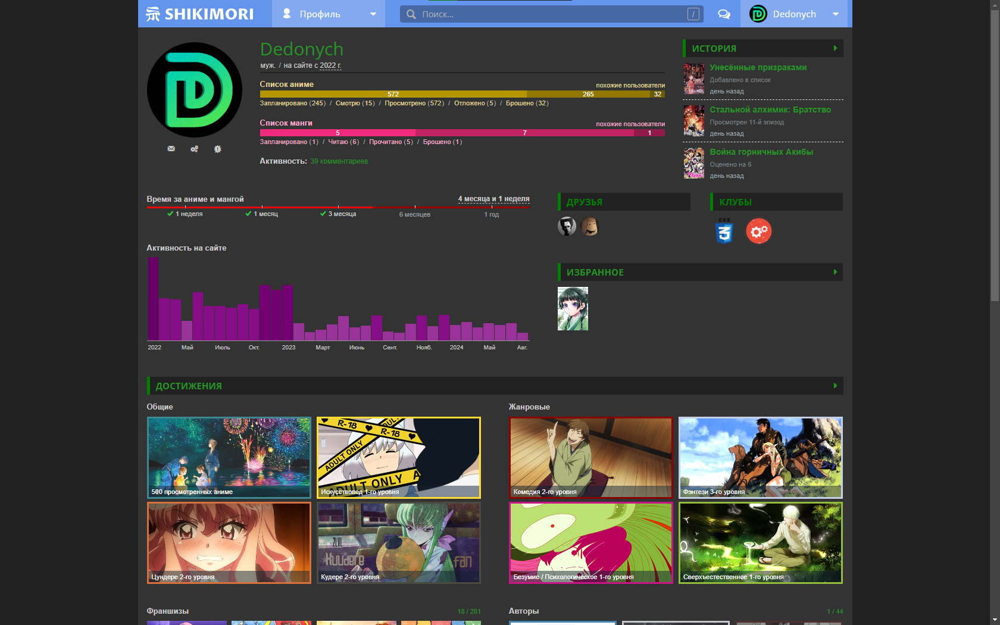

_В разработке!_

# Темная тема для сайта shikimori.me

## Для начала

Добавьте стиль и создайте в `:root` (по желанию):

```css
/* Импорт стиля */

@import url(https://raw.githubusercontent.com/Dedonych/Shikimori-Dark-Theme/master/shikimori_dark.css);

:root {
  --my-clr:/* Ваш основной цвет (стандартный - #5292d2 - светло синий)*/ ;
}
```

Цвета плохо работают с черным и белым

### Добавляйте в `:root` строчки, чтобы:<br>

- `--news:none` - отключить подсказку в настройках <br>

- `--dropdown:var(--my-clr)` - верхнее меню изменить на основной цвет<br>

- `--link-primary:var(--my-clr)` - сделать основной текст основным цветом (или каким хотите)<br>

#### Темы

Если отключаете темы и хотите оставить стандартный цвет верхнего меню, установите `--dropdown:var(--bckg-dark)`

- `--themes-clr: var(--my-clr)` - отключить все темы для основных цветов <br>
- `--themes-dropdown: var(--dropdown)` - отключить все темы для верхней менюшки <br>
Для отключение какой-то темы, пишите по типу: `--название_темы-(clr/dropdown).` 

Пример: `--halloween-clr, --xmas-dropdown`
- `--icon:var(--def-icon)` - установить дефолт лого

### Некоторые фичи

Для всех фич, исользуются цвета

```css
:root {
  --my-clr: green;
  --dropdown: cornflowerBlue;
}
```
<details>
	<summary>Полоса прокрутки</summary>

```scss
::-webkit-scrollbar {
  width: 8px;
}
::-webkit-scrollbar-thumb {
  background: var(--dropdown);
}
```

</details>

<details>
	<summary>Градиент на фоне и хедлайны красивые</summary>

```scss
/* убрать фон */
.l-page {
  background-color: #0000;
}

/* gradient background: !important для всех разрешений */
body {
  --_b-l: color-mix(in srgb, var(--my-clr), #000 75%);
  --_b-r: color-mix(in srgb, var(--dropdown), #000 75%);
  background: linear-gradient(90deg, var(--_b-l), var(--_b-r)) !important;
}

/* хедлайны */
.subheadline,
.midheadline,
.headline {
  background-color: #0000;
  border: 0;
  border-bottom: 2px solid currentColor !important;

  /* треугольник заменить на ссылку */
  & > a:before {
    content: "\01f517";
  }
}
```


</details>

<details>
	<summary>Списки в одну строку и подсветка онгоингов \ анонсов</summary>

```scss
/* Списки: одна строка */
tr.user_rate {
  border-bottom: 1px solid #555;
}
tr.user_rate .name {
  display: flex;
  flex-wrap: wrap;
  position: relative;
  a {
    overflow: hidden;
    display: -webkit-box;
    -webkit-box-orient: vertical;
    -webkit-line-clamp: 1;
  }
  &:has(.rewatches:not(:empty)) a {
    max-width: calc(100% - 150px);
  }

  .rate-text {
    width: 100%;
    div {
      border-top: 1px dashed #555;
      padding-top: 2px;
      color: var(--txt-secondary-dark);
    }
  }
}

/* Подсветка онгоингов \ анонсов */
tr.user_rate :is(.anons, .ongoing) {
  display: none;
}
tr.user_rate:has(.anons) {
  background: #ff851b43;
  &:hover {
    background: #d36b1043 !important;
  }
}
tr.user_rate:has(.ongoing) {
  background: #2ecc4043;
  &:hover {
    background: #1b9e2b43 !important;
  }
}
/* ховер на обичке в списке */
.p-user_rates-index .list-lines .selectable:hover {
  background-color: #0006;
}
```


</details>

<details>
	<summary>Цветной турболинк ( полоска сверху когда идет загрузка )</summary>
	
```scss
@media all {
  .turbolinks-progress-bar {
    background: var(--clr-main-light) !important;
    -webkit-box-shadow: 0 0 8px var(--my-clr) !important;
    box-shadow: 0 0 10px var(--my-clr) !important;
  }
}
```
</details>
<details>
	<summary>Цветные списки в хедере</summary>
	
```scss
.l-top_menu-v2 .submenu {
  border: 0;
  border-radius: 0 0 8px 8px;
  --c20: color-mix(in srgb, var(--dropdown), #000 20%);
  --c30: color-mix(in srgb, var(--dropdown), #000 30%);
  --c40: color-mix(in srgb, var(--dropdown), #000 40%);
  & > .legend { background-color: var(--c30); }
  & > a {
    background-color: var(--c20);
    &:hover,
    &:active { background-color: var(--c40); }
  }
}
```


</details>

<details>
	<summary>Для мобильной версии добавить вниз кнопки</summary>

```scss
@media screen and (max-width: 767px) {
  body {
    margin-bottom: 48px;
    --icon-width: calc(calc(100vw / 5));
  }
  :is(
      .icon-profile,
      .icon-anime_list,
      .icon-manga_list,
      .icon-mail,
      .icon-settings
    ) {
    &::after {
      font-family: shikimori;
      position: fixed;
      bottom: 0;
      width: var(--icon-width);
      height: 48px;
      left: calc(var(--icon-width) * var(--icon-left));
      background-color: var(--dropdown);
      text-align: center;
      font-size: 1.5rem;
      z-index: 2;
    }
    &:focus:after {
      background: color-mix(in srgb, var(--dropdown) 70%, white);
    }
  }
  .icon-anime_list:after {
    --icon-left: 0;
    content: "\eba5";
  }
  .icon-manga_list:after {
    --icon-left: 1;
    content: "\eba6";
  }
  .icon-profile:after {
    --icon-left: 2;
    content: "\e849";
    font-size: 2.5em;
  }
  .icon-mail:after {
    --icon-left: 3;
    content: "\e81f";
  }
  .icon-settings:after {
    --icon-left: 4;
    content: "\e822";
  }
  /* смс анрид */
  .l-top_menu-v2 .menu-dropdown > span[data-unread_count]:after {
    position: fixed;
    z-index: 3;
    top: auto;
    bottom: 24px;
                   /*  позиция смс \/  */
    left: calc(var(--icon-width) * 3 + calc(var(--icon-width) / 2));
  }
}
```


</details>

<details>
	<summary>Изменить цвет прогресс баров в профиле</summary>

```scss
:root {
  /* График активности */
  --bar-main: purple;
}
/* Полоски */
.b-stats_bar {
  &.anime {
    --first: #b49602;
  }
  &.manga {
    --first: rgb(241, 44, 124);
  }
  &.lifetime {
    --first: red;
  }
}
```



</details>

## ColorPicker JS

Для удобного поиска цветов, можете использовать данный скрипт [colorpicker.js](colorpicker.js).

<br>

Можно использовать [TamperMonkey](https://www.tampermonkey.net/) или другое расширение. Или просто вставить в консоль код (F12 для Chrome).

<br>

Описание функций:

- Можно переносить по всей странице (зажали мышкой, не на кнопках, и поехали) (при перезагрузке - не сохраняет позицию)

- Изменение цвета `--my-clr`

- Изменение цвета `--dropdown`

- Блокировка цветов

- Поменять местами цвета

- Рандомные цвета

- Рандомные похожие цвета. Если цвет заблокирован, будет изменятся цвет от того, который был до рандома.

- Скопировать в буфер готовые строчки, для удобного вставление на сайт

- Сбросить кастомные цвета, к тем , что у вас стояли, и снимется блокировка

## Как выглядит


## С применением `--dropdown`


## С применением `colorpicker.js`


